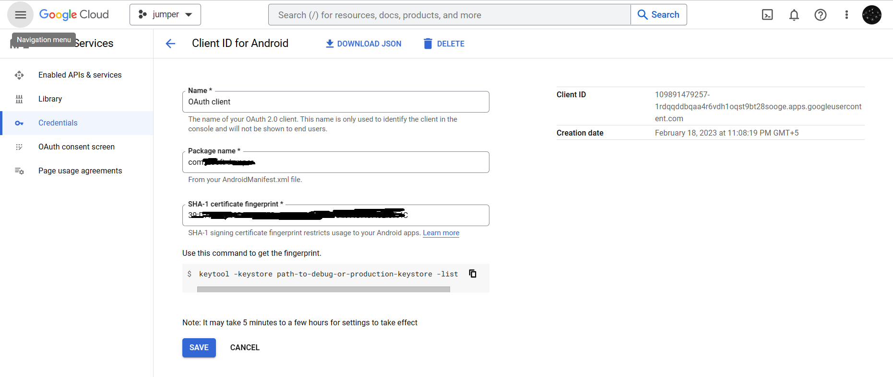

# Google Signin Unity3D Demo


## How to setup

- Setup a Unity App on Firebase.
- Import both the plugin mentioned in the repository.
- Open Publishing settings in Player settings and click on Keystore manager to generate a release keystore. 

- Go to the folder where the keystore is located and open a terminal.
- Run the keytool utility provided with Java to get the SHA-1 fingerprint of the certificate. You should get both the release and debug certificate fingerprints.
- To get the release certificate fingerprint:

```
keytool -list -v -alias <your-key-name> -keystore <path-to-production-keystore>
```
- To use google auth, you need to provide some additional information to finish setting up your project. Create a project in the Google console and specify your package name (Eg: com.google.samples.quickstart.signin) when prompted. You will also need to provide the SHA-1 hash of your signing certificate. 

https://developers.google.com/identity/sign-in/android/start




For more: 

- https://developers.google.com/android/guides/client-auth
- https://github.com/googlesamples/google-signin-unity